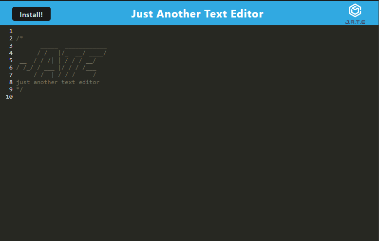

# Progressive-Writeme-App

Just another text editor converted to a progressive web application

## Link to the Deployed App
https://progressive-writeme-app.herokuapp.com/

## Dependencies
* [express](https://expressjs.com/)
* [if-env](https://www.npmjs.com/package/if-env)
* [code-mirror-themes](https://www.npmjs.com/package/code-mirror-themes)
* [idb](https://www.npmjs.com/package/idb)

## DevDependencies
* [concurrently](https://www.npmjs.com/package/concurrently)
* [nodemon](https://www.npmjs.com/package/nodemon)
* [@babel/core](https://www.npmjs.com/package/@babel/core)
* [@babel/plugin-transform-runtime](https://www.npmjs.com/package/@babel/plugin-transform-runtime)
* [@babel/preset-env](https://www.npmjs.com/package/@babel/preset-env)
* [@babel/runtime](https://www.npmjs.com/package/@babel/runtime)
* [babel-loader](https://www.npmjs.com/package/babel-loader)
* [css-loader](https://www.npmjs.com/package/css-loader)
* [html-webpack-plugin](https://www.npmjs.com/package/html-webpack-plugin)
* [http-server](https://www.npmjs.com/package/http-server)
* [style-loader](https://www.npmjs.com/package/style-loader)
* [webpack](https://www.npmjs.com/package/webpack)
* [webpack-cli](https://www.npmjs.com/package/webpack-cli)
* [webpack-dev-server](https://www.npmjs.com/package/webpack-dev-server)
* [webpack-pwa-manifest](https://www.npmjs.com/package/webpack-pwa-manifest)
* [workbox-webpack-plugin](https://developer.chrome.com/docs/workbox/modules/workbox-webpack-plugin/)
